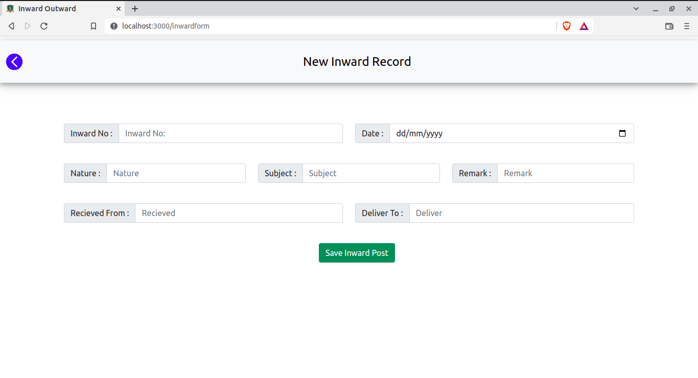
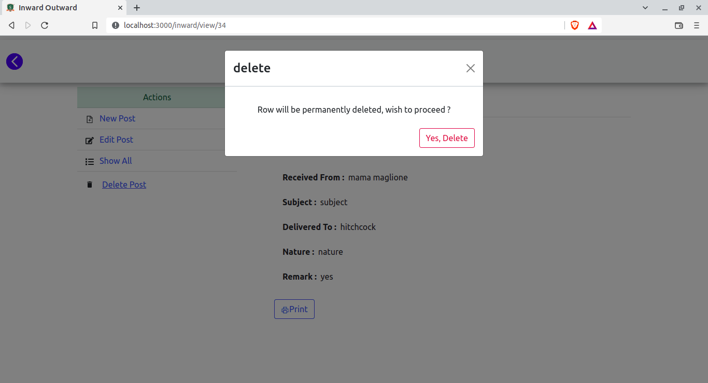
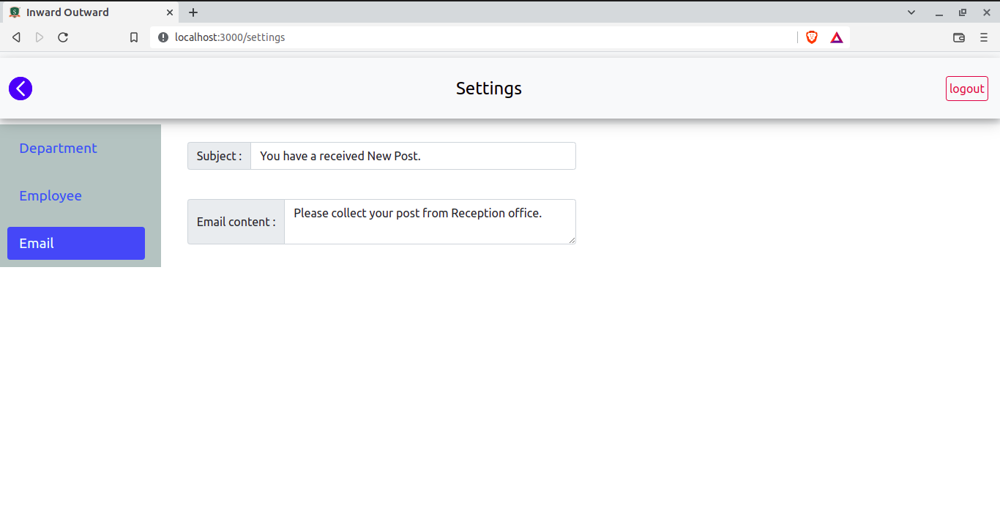

# Inward Outward - Web Application Development
Inward-Outward is designed to keep digital logs of all the Incoming & Outgoing Post in an Organisation.  

## Key-Features
- Search through Thousands of Post in a very second.
- Back-up Solution to all the Inward & Outgoing Post.
- Email Service to notify the Recipient about the Post.
- Export data through PDF, CSV, XL .
 

## Design

 

## Screenshots of InwardOutward Application

|  |  |
|:-------------------------:|:-------------------------:|
| Login Page | Register Page|
|||

## Dashboard

|  |
|:-------------------------:|
| Dashboard |
||

## Inward Page

|  |  |
|:-------------------------:|:-------------------------:|
| Inward Page | Add Inward|
|||
| Update Inward | View Inward |
|||
| Delete Inward | Send Email |
|||

## Outward Page

|  |  |
|:-------------------------:|:-------------------------:|
| Outward Page | Add Outward |
|||
| Update Outward | Delete Outward |
|||

| |
|:-------------------------:|
| View Outward |
||

## Report 

| | |
|:-------------------------:|:-------------------------:|
| Inward Report | Outward Report  |
|||
| Pdf download option | Pdf Result| 
|||
| CSV donwload option| Csv Result |
|||
| Xl download option | Xl Result |
|||
| Print option | Search Result |
|||

## Settigs Page

|  |  |
|:-------------------------:|:-------------------------:|
| Employee | Department |
|||
| Email | Side bar |
|||

